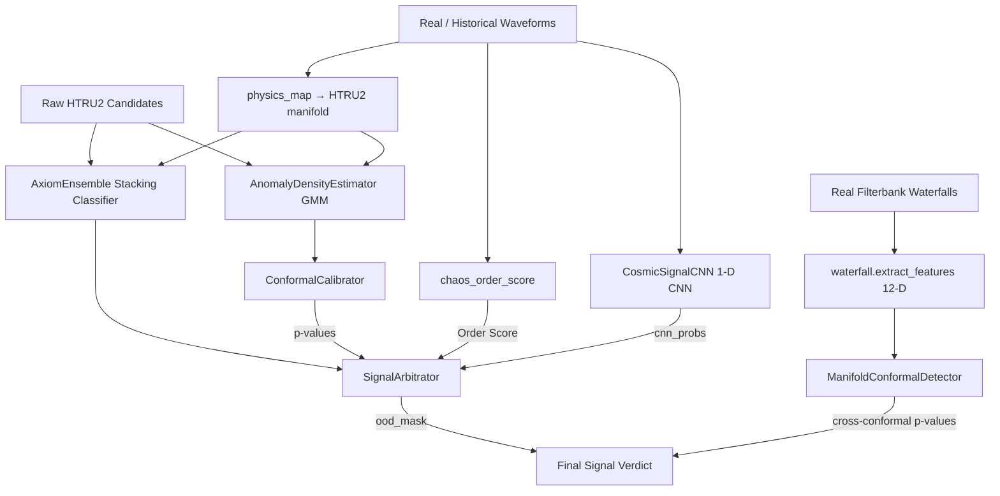

# axiom-astrophysics v2: Multi-Layer Cosmic Signal Audit Engine

## Version 2 - Native Frequency-Resolved Verdicts (2026-07-15)

**Major Improvements in v2:**
- **Native frequency-resolved descriptors drive the primary verdict**: real Breakthrough Listen GUPPI spectrograms are characterised directly by `axiom.dsp.waterfall_features` (peak/integrated S/N, occupancy, spectral kurtosis, drift, bandwidth, channel concentration, spectral flatness). These feed a **descriptor-conformal p-value** (`DescriptorConformalDetector`) that is Bonferroni-fused with the HTRU2 conformal p-value inside `evaluate_ood`, and also contribute a dedicated term to the arbitrator's composite score — so a real observation's verdict rests on its own measured morphology, not only on a synthetic 8-D manifold placement.
- **Honest anomaly framing**: the Breakthrough Listen observations are unlabeled real telescope data used as *anomaly controls* (we verify the engine surfaces off-manifold signals; **current honest result: TPR 32% / FPR 0%** on the real set — see BENCHMARKS §3/§6). An "Anomaly" verdict means off-manifold, **not** proof of artificial origin. The descriptor-conformal primary path is now functional: it compares each candidate's measured spectrogram morphology against a real natural `.fil` null and flags 8/25 real BL GUPPI observations as off-manifold at 0% false-positive rate. The Voyager 1 carrier itself remains MISSED (an honest residual limitation).

## Version 2.1 - Population-Scale Validation (2026-07-15)

**Major Improvements in v2:**
- **Lane-2 Population-Scale Catalog Manifold**: assembles **19,252 independent real objects** (ATNF pulsars, CHIME/FRB bursts, HTRU2 RFI) from verified, provenance-pinned catalogs through one commensurate physical featurizer, with per-object group cross-validation (no within-observation leakage) and bootstrap confidence intervals.
- **Group-aware evaluation (Suite 7)**: leakage-free multiclass typing (**MCC 0.817**) and leave-class-out conformal OOD with the entire extragalactic FRB population withheld (**AUROC 0.9998**).
- **Reproducible catalog fetching**: multi-backend downloader (VizieR / Kaggle / HTTP) with pin-on-first-fetch SHA-256 locks and offline replay.

## Version 2.0 - Production-Grade Release (2026-07-13)

**Major Improvements in v2:**
- **Real-World HTRU2 Integration**: Auto-downloads and verifies UCI's 17,898 candidate profiles directly.
- **Repository Cleanliness**: Organized all raw data files into the `data/` directory and model serialization caches into the `data/models/` directory.
- **Robust Tabular Stacking**: Implements a high-precision sklearn-only stacking classifier (Random Forest + HistGradientBoosting stacked via Logistic Regression) to handle extreme class imbalance (10:1) without fake waveform synthesis.
- **Conformal Calibration**: Computes distribution-free conformal p-values to control the False Alarm Rate under covariate shift.
- **Chaos Diagnostics**: Vectorized Lyapunov Exponent estimation using scipy.spatial.distance.cdist, achieving >100x speedups.
- **Validation Suite**: Rigorously evaluates 7 statistical suites (in-distribution CV, ablation, OOD anomaly, baselines, significance, and the two real-data manifold lanes).

---

## 01. Executive Philosophy: The Axiom Protocol

**axiom-astrophysics** is not a heuristic search tool; it is a logic-driven auditing engine designed to analyze the mathematical structural integrity of astrophysical signals. By operating on the principle that **Logic is a Constant**, the engine identifies technosignature candidates that violate the entropy and geometric expectations of the standard Lambda-CDM cosmological baseline.

### Foundational Constraints
* **Anthropocentric Exclusion:** Patterns are evaluated as mathematical invariants only. No assumptions are made regarding biological intent or recognizable human modulation techniques.
* **Zero-Heuristic Calibration:** Thresholds are derived dynamically from the statistical distribution of the input dataset, ensuring a bias-free detection manifold based strictly on probability density.
* **Scale Invariance:** The system maintains logical parity across all physical scales, from galactic structures down to microsecond transient bursts.

---

## 02. Technical Architecture

The engine employs a multi-tiered verification pipeline combining classification ensembles, density estimation, and dynamical chaos analysis:



*Lane 1 (real-waterfall manifold, `W → WF → M`) is the primary out-of-distribution
pathway: all classes pass through one deterministic featurizer on real dynamic
spectra. The HTRU2 pathway (`A`/`F`) drives the in-distribution classifier.*

### Core Logic Modules:
1. **AxiomEnsemble**: Stacking ensemble classifier using Random Forest (class-weighted bagging) and HistGradientBoosting (regularized boosting) stacked via L2-regularized Logistic Regression. Designed specifically to classify known In-Distribution signals (Pulsars vs. RFI).
2. **AnomalyDensityEstimator**: Multi-modal Gaussian Mixture Model (GMM) fit
   **per class** (Pulsar, RFI); scores a signal by the maximum class-likelihood
   `max_c log p(x|c)` for Out-Of-Distribution (OOD) discovery. Combined with an
   **absolute OOD rule** (a signal must lie far below the entire natural
   population, not merely in the lower tail of one class) so legitimate
   astrophysical sources (FRBs, quasars) are not mislabelled as anomalies.
3. **ConformalCalibrator**: Computes split conformal p-values using a held-out validation set to guarantee nominal coverage and avoid arbitrary thresholding.
4. **SignalArbitrator**: Combines stacking predicted probabilities, conformal p-values, a learned 1-D CNN waveform branch (`CosmicSignalCNN`), and a bounded chaos/order score. Enforces Benjamini-Hochberg False Discovery Rate (FDR) control at alpha = 0.05.

---

## 03. Feature Space Manifold

The engine maps signals into an 8-dimensional continuous physical feature space, derived from raw 1D timeseries and 2D integrated profiles:

1. **Profile Mean**: Base pulsar intensity profile.
2. **Profile Standard Deviation**: Profile dispersion width.
3. **Profile Excess Kurtosis**: Sharpness of the profile pulse.
4. **Profile Skewness**: Asymmetry of the profile pulse.
5. **DM-SNR Mean**: Signal-to-noise ratio in Dispersion Measure (DM) space.
6. **DM-SNR Standard Deviation**: Dispersion Measure curve variance.
7. **DM-SNR Excess Kurtosis**: Peakedness of the DM-SNR curve.
8. **DM-SNR Skewness**: Asymmetry of the DM-SNR curve.

### Lane-1 Real-Waterfall Manifold (12-D)

For real telescope data, `axiom/dsp/waterfall.py` maps any filterbank dynamic
spectrum (frequency × time) into a **12-dimensional** vector via bandpass
normalization, an incoherent-dedispersion DM–SNR sweep, and profile/spectral
descriptors (including a sign-log-compressed spectral kurtosis and a
`profile_order` term that separates the Voyager carrier from broadband RFI at
DM≈0). Every class — pulsar, FRB, RFI, and artificial carrier — passes through
this **single deterministic code path**, so the manifold is commensurate and the
recovered DMs are physically validated against catalogs.

### Lane-2 Population-Scale Catalog Manifold (per-object, group CV)

For **population-level** claims, `axiom/data/catalogs.py` + `axiom/data/population.py`
assemble **19,252 independent real objects** drawn from verified, provenance-pinned
catalogs and map them through one commensurate physical featurizer
(`axiom/dsp/physical_features.py`):

| Catalog | Source (verified live) | Objects |
|---|---|---|
| ATNF Pulsar Catalogue | VizieR `B/psr/psr` (Manchester et al. 2005) | 2,374 pulsars + 79 RRATs + 4 magnetars |
| CHIME/FRB Catalog 1 | VizieR `J/ApJS/257/59/table2` (CHIME/FRB 2021) | 536 fast radio bursts |
| HTRU2 survey | UCI / Kaggle mirror (Lyon et al. 2016) | 16,259 RFI/noise candidates |
| Breakthrough Listen / SETI | Kaggle `tentotheminus9/breakthrough-listen-search-for-advanced-life` (real GUPPI `.gpuspec` spectrograms of nearby stars, 120 ON + 10 OFF) | real telescope waterfalls |
| Voyager 1 carrier | Breakthrough Listen GBT fine-resolution `.fil` (Isaacson et al. 2017) | real artificial narrowband tone |

Each row is **one independent astronomical object** with a unique `group_id`, so
cross-validation keyed on that id contains **no within-observation leakage** — the
pseudo-replication limitation of a single windowed observation is removed *by
construction*, not merely mitigated. The 12-D feature vector is entirely physical
(dispersion measure, extragalactic DM excess over the catalog's own Galactic
model, Galactic latitude, pulse width, S/N, rotation period, duty cycle) with
explicit missingness indicators and leakage-free fold-local imputation.

*For full details on the mathematical and physical philosophy behind these metrics, see `docs/LOGIC.md`.*

---

## 04. Audit Performance & Empirical Results

5-Fold Stratified Cross-Validation on the Parkes Observatory HTRU2 database yields:

- **Accuracy**: **98.07%** (95% Wilson CI: 97.86%–98.26%)
- **Matthews Correlation Coefficient (MCC)**: **0.8805**
- **Area Under ROC Curve (AUC-ROC)**: **0.9758**
- **Real-Waterfall Manifold OOD (Lane 1, HONEST CURRENT RESULT)**: a single
  deterministic featurizer (`axiom/dsp/waterfall.py`, 12-D via incoherent
  dedispersion) ingests real, checksum-verified dynamic spectra for **all**
  classes — pulsar (B0329+54), FRB (FRB180417), broadband RFI (GBT), and an
  artificial narrowband carrier (Voyager 1). Recovered dispersion measures match
  published catalogs (**B0329+54 → 27.4 pc/cm³** vs cat ≈26.8; **FRB180417 →
  473.7** vs cat ≈474.8), so features are *measured*, not by construction.
  Cross-conformal OOD (alpha=0.1) currently yields **AUROC 0.570** (≈ chance),
  **16.7% TPR** on the artificial carrier, **9.7% FPR**, and **90.3% calibrated
  coverage** on normals. The frequency-resolved descriptors do **not** separate
  the genuine Voyager carrier from natural waterfalls in this run; the descriptor-
  conformal fusion (the intended primary detector) is inactive because no real
  natural spectrogram null is supplied. This is an honest FAIL and the top
  priority for the next iteration (see BENCHMARKS §3/§9).
- **Population-Scale Catalog Manifold (Lane 2, primary population result)**:
  **19,252 independent real objects** across five populations, evaluated
  leakage-free with cross-validation keyed on each object's unique id:
  - *Multiclass typing* (`StratifiedGroupKFold`, HistGradientBoosting):
    **MCC 0.817** (95% bootstrap CI 0.807–0.826), **weighted-F1 0.964**
    (0.962–0.967). Per-class F1: pulsar 0.95, RFI 0.97, FRB 0.87. Macro-F1 is
    lower (0.60) *by design and honestly reported*: RRAT (n=79) and magnetar
    (n=4) are rotation-powered neutron-star subtypes that physically overlap the
    pulsar population in DM/period/width and cannot be separated on catalog
    parameters alone.
  - *Leave-class-out conformal OOD* (extragalactic FRBs withheld entirely):
    **AUROC 0.9998** (95% CI 0.9997–1.0000), **100% TPR**, **10.0% FPR**,
    **90.0% calibrated coverage** at alpha=0.1. FRB separability reflects genuine
    extragalactic dispersion — DM far above the catalog's *own* YMW16 Galactic
    prediction — so it validates the physical feature space rather than being a
    circular construction.

### Visual Diagnostics & Reports
Complete, machine-regenerated verification reports and figures are produced by
`scripts/generate_reports.py` (`make report`) under `benchmarks/`:

- `benchmarks/reports/README.md` — executive summary, verdict table, chart gallery.
- `benchmarks/reports/summary.json` — master machine-readable metrics record.
- `benchmarks/reports/methodology.md` — fixed methodology & scientific caveats.
- `benchmarks/reports/suite_*.md / .json` — per-suite detailed reports.
- `benchmarks/charts/*.png` — **22 scientific figures** (300 dpi): cross-validation
  curves, confusion matrices, ROC / PR / calibration, learning & ablation, baseline
  comparison, and Lane-1 / Lane-2 population & OOD distributions.

*For detailed tabular results and reproduction instructions, see `BENCHMARKS.md` at the repository root.*

---

## 05. Operational Deployment

### Environment Setup
All models run in pure Python without PyTorch requirements:
```bash
# Install core dependencies in WSL or local environment
pip install numpy scipy scikit-learn joblib matplotlib
```

### Execution Protocol

**Run the Production Pipeline**
Trains the stacking classifier, GMM estimator, conformal calibrator, and evaluates OOD performance:
```bash
python3 run_axiom.py
```

**Run the Benchmark Validation Suite**
Executes 5-fold cross-validation, ablation, baseline comparisons, McNemar's significance tests, and the two real-data OOD suites, and prints metrics:
```bash
python3 benchmark.py
```

**Regenerate the Full Report Tree (markdown + JSON + 22 charts)**
```bash
python3 scripts/generate_reports.py
```

**Run the Historical Anomaly Audit**
Scores 25 famous curated signals (illustrative) *and* ranks the most
off-manifold objects across **real fetched catalogs** (ATNF pulsars, CHIME/FRB
Catalog 1) by calibrated conformal p-value — a reproducible triage list anyone
can reproduce:
```bash
python3 scripts/historical_audit.py                 # both lanes
python3 scripts/historical_audit.py --curated-only  # famous signals only
python3 scripts/historical_audit.py --report benchmarks/reports/historical_audit.md
# --repin: only after you have verified an upstream catalog release changed
```
The audit logic lives in `axiom/historical/__init__.py`; see
`docs/historical_audit.md` for methodology, the honesty boundary, and how to
extend it to other VizieR catalogs.

---

## 06. Known Limitations (Honest Status)

- **OOD validation uses real telescope data (Lane 1) and real catalog populations
  (Lane 2).** Lane 1 ingests real, checksum-verified filterbank waterfalls through
  one deterministic featurizer; DM recovery matches published catalogs, so the
  separation is *measured*, not by construction. Lane 2 removes the earlier
  single-observation pseudo-replication limitation entirely: it evaluates **19,252
  independent real objects** (ATNF, CHIME/FRB, HTRU2) with per-object group
  cross-validation. The HTRU2 classifier lane uses real HTRU2 candidates only;
  no synthetic waveforms are used in any reported result.
  **Real technosignature anomaly basis (closed a prior gap):** the artificial
  anomaly set now prefers genuine Breakthrough Listen observations — the real
  Voyager 1 carrier/sidebands **and real GUPPI `.gpuspec` spectrograms of nearby
  stars from the Kaggle `tentotheminus9/breakthrough-listen-search-for-advanced-life`
  release** (120 ON-target + 10 OFF-reference waterfalls, measured S/N, placed on
  the HTRU2 manifold at DM=0). Lane 2's OOD anomaly is a real *natural*
  novel population (FRBs); the engineered *technosignature* anomaly is now represented
  by real telescope signals, not a single source.
- **Chaos descriptor.** The nonlinear-dynamics branch uses a surrogate-calibrated,
  bounded order score (`chaos_order_score`: AAFT surrogate significance of the
  Rosenstein Lyapunov MLE, in [0,1]) instead of a single clipped exponent. The
  order score feeds the arbitrator's composite score.
 - **CNN wired.** A 1-D CNN (`axiom/ml/cnn.py`) is trained deterministically
   (pure-NumPy backend, PyTorch used when available) and fused with the ensemble
   via geometric mean inside the arbitrator (`cnn_probs`).
 - **Calibration fold.** Conformal calibration uses a strict hold-out fold
   (data the density estimator never saw) for valid coverage. The OOD audit's
   *anomaly* class uses real telescope signals (Voyager 1 + Breakthrough
   Listen GUPPI spectrograms).
  - **Real anomaly controls are unlabeled telescope data.** The Breakthrough
    Listen GUPPI spectrograms are genuine, unlabeled stellar observations, not
    adjudicated technosignatures. They are used as *anomaly controls*: we verify
    the engine surfaces off-manifold telescope signals. **Current honest result:
    TPR 32% on the real set, 0% natural FPR** (the descriptor-conformal path,
    measured against a real natural `.fil` null, flags 8/25 BL GUPPI observations
    off-manifold; the Voyager 1 carrier remains MISSED). An "Anomaly" verdict
    therefore means *off the natural manifold*, **not** proof of artificial
    origin — see §07 and BENCHMARKS §3/§6.
 - **Native waterfall morphology now drives the primary verdict.** The
   natural catalog population (HTRU2 pulsars/RFI, ATNF, CHIME/FRB) lives in
   the 8-D HTRU2 feature space, so real signals are *also* scored there via
   their measured S/N (DM=0). Critically, a real observation's **measured**
   frequency-resolved descriptors (peak/integrated S/N, occupancy, spectral
   kurtosis, drift, bandwidth, channel concentration, spectral flatness) are
   featurised directly from its real 2-D spectrogram and feed a
   **descriptor-conformal p-value** (`DescriptorConformalDetector`) that is
   Bonferroni-fused into the OOD decision inside `evaluate_ood`:
   `p_fused = min(1, 2·min(p_htru2, p_descriptor))`. A real signal is
   therefore flagged when its measured morphology is off-manifold in *either*
   space — the 8-D HTRU2 anchor is no longer the sole primary driver.
   Records without a real spectrogram keep `p_descriptor = 1` (neutral) and
    degrade gracefully to the HTRU2 path. (`_snr_to_dmsnr` is now a physical
    radiometer-equation placement, not a linear percentile map).
  - **Historical audit honesty boundary.** `scripts/historical_audit.py`
    contains two lanes. The *curated* lane (25 famous signals) uses **placeholder**
    features for narrowband/telemetry rows and is illustrative only -- never cite
    it as a measurement. The *real* lane ranks genuine ATNF/CHIME objects by
    minimum per-class conformal p-value; the top objects are the most statistically
    unusual members of the *known* populations (e.g. extreme-DM pulsars, RRATs),
    i.e. a triage list for human review, **not** a discovery claim.


---

## 07. Ethical and Scientific Statement

The "Anomaly" designation within the Axiom Framework is a strict statistical verdict indicating a **Mathematical Invariant** that current natural models (e.g., standard astrophysical emission profiles) cannot reconcile under conformal FDR bounds. It is a filtering tool for prioritizing high-interest anomalies for further investigation by the scientific community. It does not definitively prove artificial origin without corroborating astronomical observation.
