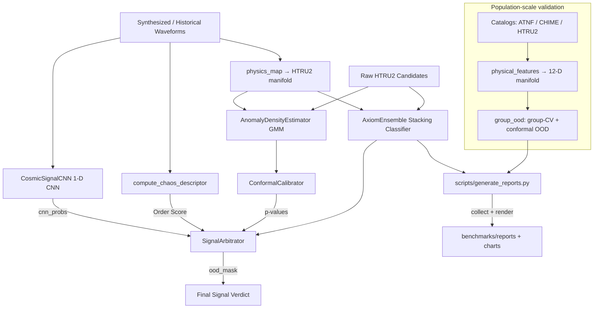

# axiom-astrophysics v2 — System Architecture & Algorithm Design

This document details the software architecture, signal processing pipeline, and statistical arbitration logic of the AXIOM astrophysics signal auditor.

---

## 1. Modular Core Architecture

The system is structured as follows:

### Components:
1. **`axiom.data`**: Handlers for HTRU2 datasets (robust local caching, validation splitting) and verified, provenance-pinned catalogs (`catalogs`, `population`) assembled into the population-scale manifold. Catalog cross-checks such as SIMBAD are optional and require `astroquery`; without it the system runs without live querying.
2. **`axiom.dsp`**: HTRU2 waveform complexity feature extractors (fractal dimension, Lempel-Ziv complexity, Shannon entropy, drift rates, harmonic structure) and the commensurate Lane-2 physical featurizer `physical_features` (12-D DM/width/SNR/period/indicator vector).
3. **`axiom.ml`**: Stacking ensemble classifier (Random Forest + Gradient Boosting stacked via Logistic Regression), Gaussian Mixture Model (GMM) density estimators, and a trainable 1-D CNN (`CosmicSignalCNN`, pure-NumPy backend).
4. **`axiom.stats`**: Conformal calibrators mapping GMM scores to distribution-free p-values, nonlinear-dynamics chaos descriptors (`compute_chaos_descriptor`), the `SignalArbitrator`, and the leakage-free population evaluators (`group_ood`).
5. **`axiom.reporting`**: Deterministic report generator — `collect` (re-runs every validation suite), `charts` (22 scientific figures), `report_writer` (markdown + JSON under `benchmarks/`). Replaces the old `Benchmark/` artifacts.

---

## 2. Feature Extraction & Manifold Mapping

The system uses **two** complementary feature streams:

### 2a. Physics-based manifold mapping (primary)
Every signal is placed onto the **HTRU2 8-dimensional survey manifold** (the 8
real HTRU2 moments; the 9th column of the dataset is the class label) via
`physics_map_htru2_features(signal_type, dm, snr, seed)`. Natural and
interference sources are anchored to real HTRU2 exemplars; genuine narrowband
carriers (Wow!, BLC1-style) are deliberately placed in an **out-of-manifold gap**
so the density estimator can detect them as OOD. The mapped vector:

$$x = [p_{\text{mean}}, p_{\text{std}}, p_{\text{kurt}}, p_{\text{skew}},
      d_{\text{mean}}, d_{\text{std}}, d_{\text{kurt}}, d_{\text{skew}}]$$

feeds both the stacking ensemble and the per-class density estimator.

### 2a-bis. Lane-2 population-scale physical manifold (primary population claim)
For population-level validation the system bypasses the HTRU2 anchor entirely.
`axiom.data.catalogs` + `axiom.data.population` assemble **19,252 independent real
objects** (ATNF pulsars, CHIME/FRB bursts, HTRU2 RFI) from verified,
provenance-pinned catalogs, and `axiom.dsp.physical_features.featurize_frame` maps
each object onto one commensurate 12-D physical vector:

$$x = [\log_{10}(1{+}\mathrm{DM}),\ \mathrm{DM}{-}\mathrm{DM}_{\mathrm{gal}},\
      \mathrm{DM}/(1{+}\mathrm{DM}_{\mathrm{gal}}),\ |b|,\ \log W,\ \log S/N,\
      \log P,\ \log(\text{duty})\ \|\ \text{4 presence indicators}]$$

Because each row is one independent object with a unique `group_id`, cross-validation
keyed on that id is leakage-free by construction. `axiom.stats.group_ood` runs
stratified group K-fold multiclass typing and leave-class-out conformal OOD with
bootstrap confidence intervals (see Suite 7).

### 2b. Auxiliary DSP complexity features
For synthesis and the chaos/anomaly anchor we also compute waveform complexity
features:

$$z = [f_{\text{entropy}}, f_{\text{pe}}, f_{\text{higuchi}}, f_{\text{lz76}},
       f_{\text{drift}}, f_{\text{harmonic}}, f_{\text{intensity}}]$$

- **Entropy Score**: Shannon entropy of the waveform amplitude distribution.
- **Permutation Entropy**: Relative frequencies of ordinal patterns → chaotic vs periodic.
- **Higuchi Fractal Dimension**: Self-similarity / complexity in the time domain.
- **Lempel-Ziv Complexity (LZ76)**: Structural repetitiveness of the thresholded waveform.
- **Drift Rate**: Carrier frequency drift over time (potential acceleration signature).
- **Lyapunov Exponent / Order Score** (`compute_chaos_descriptor`,
  `chaos_order_score`): a bounded, discriminating descriptor — normalized
  permutation entropy (primary axis: periodic tones → low entropy → high order;
  noise → high entropy → low order) plus a tanh-squashed Lyapunov exponent.
  The resulting order score feeds the arbitrator's composite anomaly score.

### 2c. Native frequency-resolved waterfall descriptors (real spectrograms)
Real observations are not only projected onto the 8-D HTRU2 manifold; their
native 2-D spectrogram (frequency × time) is characterised directly by
`axiom.dsp.waterfall_features.compute_waterfall_features`. For each real
Breakthrough Listen GUPPI waterfall the module computes
**peak/integrated S/N**, **occupancy**, **spectral kurtosis**,
**drift rate**, **bandwidth**, **channel concentration** (Gini) and
**spectral flatness**.

These descriptors feed a **second, measurement-driven conformal p-value**, not
just a soft composite term. `DescriptorConformalDetector` (a split-conformal
detector over the 8-D descriptor vector) scores each real signal against a
natural/broadband null and emits a conformal p-value `p_descriptor`. Inside
`evaluate_ood` this is **Bonferroni-fused** with the HTRU2 conformal p-value:

$$p_{\text{fused}} = \min\!\bigl(1,\; 2\cdot\min(p_{\text{htru2}},\,p_{\text{descriptor}})\bigr)$$

so a real observation is flagged when its *measured* morphology is off-manifold in
**either** space. Signals without a real spectrogram keep `p_descriptor = 1`
(neutral) and degrade gracefully to the HTRU2 path. A bounded
`waterfall_narrowband_score` (high concentration + low flatness → tone-like)
additionally contributes a dedicated term to the arbitrator's composite score.
This means a real observation's verdict rests on its own measured morphology, not
only on a synthetic manifold placement.

---

## 3. High-Integrity Statistical Arbitration

Final verdicts are computed through the `SignalArbitrator.arbitrate(...,
ood_mask=...)` using classical ML plus distribution-free conformal inference:

1. **Per-class GMM scoring**: $s(x) = \max_c \log p(x \mid c)$, $c \in \{\text{Pulsar}, \text{RFI}\}$.
2. **Dual conformal fusion**: the HTRU2 conformal p-value is Bonferroni-combined
   with the native-descriptor conformal p-value (§2c) so a real signal is flagged
   when off-manifold in *either* its survey placement or its measured spectrogram
   morphology. Records lacking a real spectrogram keep `p_descriptor = 1`.
 3. **Absolute OOD rule**: a signal is only a candidate anomaly if
    $s(x) < \min_i s(x_i) - \delta$ — i.e. it lies outside the manifold of *every*
    known class, not merely in the lower tail of one.
 4. **Conformalization**: maps the score to a class-conditional p-value via a
    calibration split.
 5. **FDR Correction**: Benjamini-Hochberg control on the p-value batch bounds the
    false-alarm rate to $\alpha = 0.05$; `ood_mask` pre-filters the OOD candidates.
 6. **Learned CNN branch**: `CosmicSignalCNN` scores the raw waveform as a 3-class
    probability vector; it is fused with the ensemble via a geometric mean before
    verdict assignment.
 7. **Chaos Order contribution**: the order score (from `compute_chaos_descriptor`)
     modulates the composite anomaly score, rewarding highly ordered (deterministic)
     waveforms when classifier support exists.

---

## 4. Validation, Reporting & Reproducibility

The entire validation suite (7 test suites, see `benchmark.py`) is regenerated
deterministically into `benchmarks/` by `scripts/generate_reports.py`
(`make report`). `axiom.reporting.collect` re-executes each suite on real data
under a fixed seed (42) and records structured metrics; `charts` renders 22
300-dpi figures (cross-validation curves, confusion matrices, ROC/PR/calibration,
learning & ablation, baselines, and Lane-1/Lane-2 population & OOD distributions);
`report_writer` emits `README.md` (executive summary + verdict + chart gallery),
`summary.json` (master record), `methodology.md` (caveats), and per-suite
`suite_*.md/.json`. No numbers are hard-coded — the artifact tree is fully
reproducible from the source code and the cached real catalogs.

> All OOD/anomaly verdicts are statistical: an out-of-distribution flag means a
> signal is inconsistent with the learned *natural* population. It is **not**, by
> itself, proof of artificial origin (see `README.md` §07).
